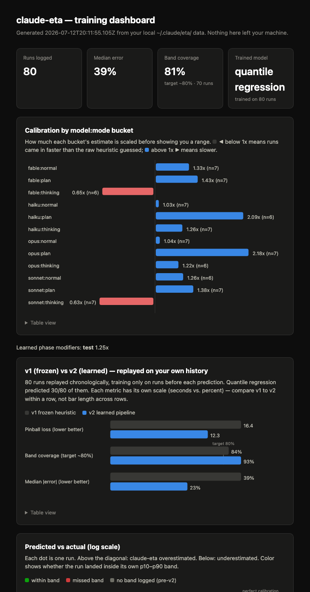

# claude-eta

**A live ETA for your Claude Code runs.** The moment you submit a prompt you
get an instant range. As Claude works, a statusline countdown ticks down —
and revises itself the second the run hits traffic: an error surfaces, a test
fails, a debug spiral starts.

No more staring at a spinner wondering if this is a 30-second fix or a
20-minute rabbit hole.


## Why

Agent runs are heavy-tailed. Most of what decides how long a run takes is
work that doesn't exist yet at the moment you hit enter — you can't know
there's a failing test three tool calls out. So claude-eta never shows you a
fake-precise number. It shows a **range** up front, then sharpens that range
as real evidence comes in: which phase Claude is in (exploring, editing,
testing, debugging), how many tool calls it's made, and how many errors it's
hit along the way. Treat it as a sense of scale, not a stopwatch.

## Install

Run these one at a time (don't paste them as one block — if they land as a
single input, the second line gets appended onto the first and errors out):

```
/plugin marketplace add https://github.com/ben564885/claude-eta
```

Use the full `https://` URL, not the `ben564885/claude-eta` shorthand — the
shorthand form makes Claude Code clone over SSH, which fails with
`SSH authentication failed` unless you already have SSH keys set up for
GitHub. The `https://` URL sidesteps that entirely.

Once that confirms, install the plugin:

```
/plugin install claude-eta@claude-eta
```

You'll be asked which scope to install into — **user scope** ("Install for
you") is the right choice for a personal tool like this; it's already
highlighted, so just press Enter. Then apply it:

```
/reload-plugins
```

That's it for the instant estimate — the moment you submit a prompt you'll
see a message like `⏱ est. ~1m–6m`.

## Get the live countdown (one extra step)

Claude Code doesn't currently let a plugin auto-install a statusline, so this
part is a one-time manual step.

**1. Open `~/.claude/settings.json`.** This is a hidden file in your home
directory (`~`, not your project folder) — if you're browsing for it in an
editor's file tree, it won't show up unless you open `~/.claude` directly or
show hidden files. Easiest is opening it by path, e.g. `code ~/.claude/settings.json`
or `cursor ~/.claude/settings.json` from a terminal.

**2. Add a `statusLine` key.** If the file already has other settings in it
(most will, e.g. `permissions`, `hooks`), add `statusLine` alongside them —
don't replace the whole file. `$CLAUDE_PLUGIN_ROOT` is not reliably expanded
in this context, so use the actual installed path instead of the variable.
Find it with:

```
find ~/.claude/plugins -iname "statusline.mjs"
```

That'll print something like
`~/.claude/plugins/cache/claude-eta/claude-eta/1.1.0/scripts/statusline.mjs`
(the version number in the path bumps on plugin updates). Use that exact path:

```json
{
  "statusLine": {
    "type": "command",
    "command": "node \"/absolute/path/to/scripts/statusline.mjs\""
  }
}
```

**3. Restart Claude Code** (or start a new session) for the statusline to
pick up. Without this step claude-eta still works fine — you just get the
instant estimate at submit time, not the ticking countdown.

## Upgrading

Custom git-based marketplaces (this one included) don't auto-update on
startup — only Anthropic's official marketplace does. To pull in a new
release:

```
/plugin marketplace update claude-eta
```

```
/reload-plugins
```

`/reload-plugins` alone only reloads whatever's already cached locally — it
won't fetch new commits. Run the `marketplace update` command first, then
`/reload-plugins` to apply the hooks/commands from the new version in your
current session (no restart needed).

If you set up the statusline (above), its path is version-pinned —
`.../claude-eta/claude-eta/1.1.0/scripts/statusline.mjs` becomes
`.../2.0.0/scripts/statusline.mjs` after an upgrade. Re-run the `find`
command from step 2 above and update the path in `~/.claude/settings.json`,
or the statusline will silently keep running the old version.

Nothing needs to change for the learning data itself — `~/.claude/eta/`
carries forward automatically; see below.

## What you'll see

- **At submit** — an instant range based on your prompt's length, file
  references, and intent (`fix`, `build`, `refactor`, `explain`, ...), plus
  the model and mode you're running.
- **While Claude works** — a statusline countdown that shrinks as time
  passes, and jumps back *up* when the run hits trouble:

  ```
  ⏱ ~3m10s left ███░░░░░ dbg +2⚠
  ```

  `dbg` is the phase Claude's currently in (`exp`/`edit`/`tst`/`dbg`/`oth`).
  `+2⚠` means two issues (errors, failed tests, tracebacks) have shown up
  since submit — that's what just widened your ETA.

## It trains on your own runs

Every finished run feeds three layers of local learning (no network calls,
no training infrastructure — plain math over `~/.claude/eta/history.jsonl`):

1. **Bayesian calibration** from run one: a posterior over the estimator's
   log-space bias per `model:mode` bucket (e.g. `opus:normal` runs
   consistently longer than predicted → future opus estimates scale up),
   shrunk toward a global posterior so a few noisy runs can't overcorrect
   everything. The width of the p10–p90 band comes from this posterior too,
   so bands tighten as evidence accumulates.
2. **A trained model** once you have 50+ runs: linear quantile regression on
   log-duration over your prompts' features (length, file refs, intent
   flags, model, mode), fit by pinball-loss gradient descent right in the
   Stop hook. It replaces the hand-tuned heuristic entirely and retrains
   itself as history grows.
3. **Survival-model countdowns** while a run is going: the statusline
   reports quantiles of total duration *given the run is still going* under
   a lognormal prior — so when a run blows past its estimate, remaining time
   correctly grows instead of snapping to zero. How much longer debug-heavy
   runs tend to drag on is itself learned from your history.

And because "more accurate" should be a measurement, not a vibe, v2 ships a
backtester: it replays your own history chronologically (training only on
runs before each prediction) and scores v1's frozen heuristic against the
v2 pipeline on pinball loss, band coverage, and median error. Ask for it via
`/eta-stats` ("run the backtest") or directly:

```
node "$CLAUDE_PLUGIN_ROOT/scripts/backtest.mjs"
```

Check on it any time:

```
/eta-stats
```

```
claude-eta — 64 runs logged

  median error:                  38%
  median actual/predicted ratio: 1.12x
  band coverage (target ~80%):   78% of 64 runs

  learned calibration (global): 1.15x over 64 runs

  by model:mode bucket:
    opus:normal        1.34x  (n=26)
    sonnet:normal      0.92x  (n=38)

  trained model:  quantile regression active (trained on 60 runs)
  learned phase modifiers: debug 1.62x, test 1.21x
```

**No manual training step — just use Claude Code normally.** Every `Stop`
hook writes one row and, once history is long enough, retrains
`model.json` automatically. There's nothing to trigger by hand.

One note if you're upgrading from a version before the model-tag fix (see
`CHANGELOG.md`): older history rows may have `unknown:normal` as the
bucket, since the model field wasn't being captured yet. That old bucket
just stops accumulating new data — it's inert clutter, not actively wrong,
so you don't need to clear it. If you'd rather start with clean buckets
anyway:

```
/eta-reset
```

Want it visual instead of text? `/eta-dashboard` generates a self-contained
local HTML report — stat tiles, per-bucket calibration bars, the v1-vs-v2
backtest comparison, and a predicted-vs-actual scatter — and opens it in
your browser:

```
/eta-dashboard
```



Same rules as everywhere else in this plugin: hand-rolled inline SVG, no
charting library, no network requests — the HTML file lives at
`~/.claude/eta/dashboard.html` and never leaves your machine.

Want to see how your own gut-feel estimate compares to the model's? Log a
guess right before you send a prompt:

```
/eta-guess 90
```

It's recorded as `dev_estimate_sec` against whichever prompt you send next
(within about 10 minutes — after that it's assumed unrelated and dropped).

## How it works

Three lightweight hooks and one small state file per session
(`~/.claude/eta/state/<session_id>.json`):

- **`UserPromptSubmit`** — computes the instant estimate (heuristics +
  learned calibration) and writes fresh session state. Pure local
  computation, no network calls. On a session's first turn only, also
  scans the repo for shape (file count, LOC, language, ...) and caches the
  result for the rest of the session — see Privacy below for exactly what's
  derived and what's hashed.
- **`PostToolUse`** — fires after every tool call, classifies it into a phase
  (`explore → edit → test → debug → other`), and revises the estimate as
  issues and phase time accumulate.
- **`Stop`** — closes out the run, appends one row to
  `~/.claude/eta/history.jsonl`, reports the predicted-vs-actual outcome to
  the calibration file, and retrains the learned artifacts (`model.json`)
  when history has grown enough since the last training.

State lives under `~/.claude/eta/` by default; set `CLAUDE_ETA_HOME` to
relocate it. Zero runtime dependencies, zero network calls — it's all plain
Node.js reading and writing local JSON.

## Privacy

Only the **shape** of a run is ever recorded — model, mode, prompt length,
file-reference count, imperative-verb count, phase timings, tool/issue
counts, durations, the predicted-vs-actual timing used for calibration, and
(as of 2.2.0) a small set of repo-shape numbers: tracked file count,
approximate LOC, primary language, whether a test suite appears present,
and whether the working tree is dirty. **Prompt text and tool output are
never stored, anywhere**, and neither is the repo's path or remote URL —
only a one-way SHA-256 hash of one of those (`repo_id`), so a later
analysis can group runs by repository without the log ever naming it.
Everything lives locally under `~/.claude/eta/`; nothing leaves your
machine.

If you use `/eta-guess <seconds>` to log your own duration estimate before
sending a prompt, that number (`dev_estimate_sec`) is recorded too, against
whichever prompt you send within the next 10 minutes.

## Development

Zero dependencies, so there's no install step — just run the tests:

```
npm test
```

(`node --test tests/*.test.mjs` directly works too.) CI runs the same
command on every push to `main`.

## Roadmap

v2 shipped the trained estimator (Bayesian calibration, quantile regression,
survival-model revision — see `CHANGELOG.md`). What's left on the list:

- **Shipped priors**: bake fitted coefficients into the repo as the default
  starting point so fresh installs don't cold-start from heuristics.
- **Richer in-flight signals**: subagent spawns and tool-call *rate* as
  revision features (a stalled rate usually means the run is near its end).
- **Per-phase sequence modeling**: history logs aggregate `phase_times`;
  logging phase *transitions* would allow a true semi-Markov remaining-work
  model instead of scalar phase modifiers.

## License

MIT
