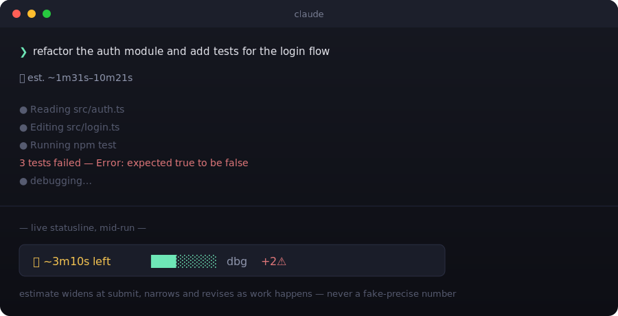

# claude-eta

**A live ETA for your Claude Code runs.** The moment you submit a prompt you
get an instant range. As Claude works, a statusline countdown ticks down —
and revises itself the second the run hits traffic: an error surfaces, a test
fails, a debug spiral starts.

No more staring at a spinner wondering if this is a 30-second fix or a
20-minute rabbit hole.



## Why

Agent runs are heavy-tailed. Most of what decides how long a run takes is
work that doesn't exist yet at the moment you hit enter — you can't know
there's a failing test three tool calls out. So claude-eta never shows you a
fake-precise number. It shows a **range** up front, then sharpens that range
as real evidence comes in: which phase Claude is in (exploring, editing,
testing, debugging), how many tool calls it's made, and how many errors it's
hit along the way. Treat it as a sense of scale, not a stopwatch.

## Install

```
/plugin marketplace add ben564885/claude-eta
/plugin install claude-eta@claude-eta
```

That's it for the instant estimate — the moment you submit a prompt you'll
see a message like `⏱ est. ~1m–6m`.

## Get the live countdown (one extra step)

Claude Code doesn't currently let a plugin auto-install a statusline, so this
part is a one-time manual step. Add this to your own `~/.claude/settings.json`:

```json
{
  "statusLine": {
    "type": "command",
    "command": "node \"$CLAUDE_PLUGIN_ROOT/scripts/statusline.mjs\""
  }
}
```

If `$CLAUDE_PLUGIN_ROOT` doesn't expand in your settings context, replace it
with the absolute path to where the plugin got installed. Without this step
claude-eta still works fine — you just get the instant estimate at submit
time, not the ticking countdown.

## What you'll see

- **At submit** — an instant range based on your prompt's length, file
  references, and intent (`fix`, `build`, `refactor`, `explain`, ...), plus
  the model and mode you're running.
- **While Claude works** — a statusline countdown that shrinks as time
  passes, and jumps back *up* when the run hits trouble:

  ```
  ⏱ ~3m10s left ███░░░░░ dbg +2⚠
  ```

  `dbg` is the phase Claude's currently in (`exp`/`edit`/`tst`/`dbg`/`oth`).
  `+2⚠` means two issues (errors, failed tests, tracebacks) have shown up
  since submit — that's what just widened your ETA.

## It learns from your own runs

Every finished run reports its predicted-vs-actual time back to a small
local calibration file. claude-eta tracks a running correction factor per
`model:mode` combination (e.g. `opus:normal` runs consistently longer than
predicted → future opus/normal estimates scale up), blended with a global
fallback so one noisy run doesn't overcorrect everything. No training step,
no network call — it's a running average that updates itself after every
run.

Check on it any time:

```
/eta-stats
```

```
claude-eta — 14 runs logged

  median error:                  38%
  median actual/predicted ratio: 1.12x

  learned calibration (global): 1.15x over 14 runs

  by model:mode bucket:
    opus:normal        1.34x  (n=6)
    sonnet:normal      0.92x  (n=8)
```

Want to wipe what it's learned and start over (e.g. after a big workflow
change)?

```
/eta-reset
```

## How it works

Three lightweight hooks and one small state file per session
(`~/.claude/eta/state/<session_id>.json`):

- **`UserPromptSubmit`** — computes the instant estimate (heuristics +
  learned calibration) and writes fresh session state. Pure local
  computation, no network calls.
- **`PostToolUse`** — fires after every tool call, classifies it into a phase
  (`explore → edit → test → debug → other`), and revises the estimate as
  issues and phase time accumulate.
- **`Stop`** — closes out the run, appends one row to
  `~/.claude/eta/history.jsonl`, and reports the predicted-vs-actual outcome
  to the calibration file.

State lives under `~/.claude/eta/` by default; set `CLAUDE_ETA_HOME` to
relocate it. Zero runtime dependencies, zero network calls — it's all plain
Node.js reading and writing local JSON.

## Privacy

Only the **shape** of a run is ever recorded — model, mode, prompt length,
file-reference count, phase timings, tool/issue counts, durations, and the
predicted-vs-actual timing used for calibration. **Prompt text and tool
output are never stored, anywhere.** Everything lives locally under
`~/.claude/eta/`; nothing leaves your machine.

## Development

Zero dependencies, so there's no install step — just run the tests:

```
npm test
```

(`node --test tests/*.test.mjs` directly works too.) CI runs the same
command on every push to `main`.

## Roadmap

The estimator (`lib/model.mjs`) combines fixed heuristics with the online
self-calibration described above — a running correction factor, not a
trained model. That's the whole seam for a real v2: swap in a proper
Bayesian posterior over the semi-Markov phases, trained on the full
`history.jsonl`, with no other file needing to change.

## License

MIT
